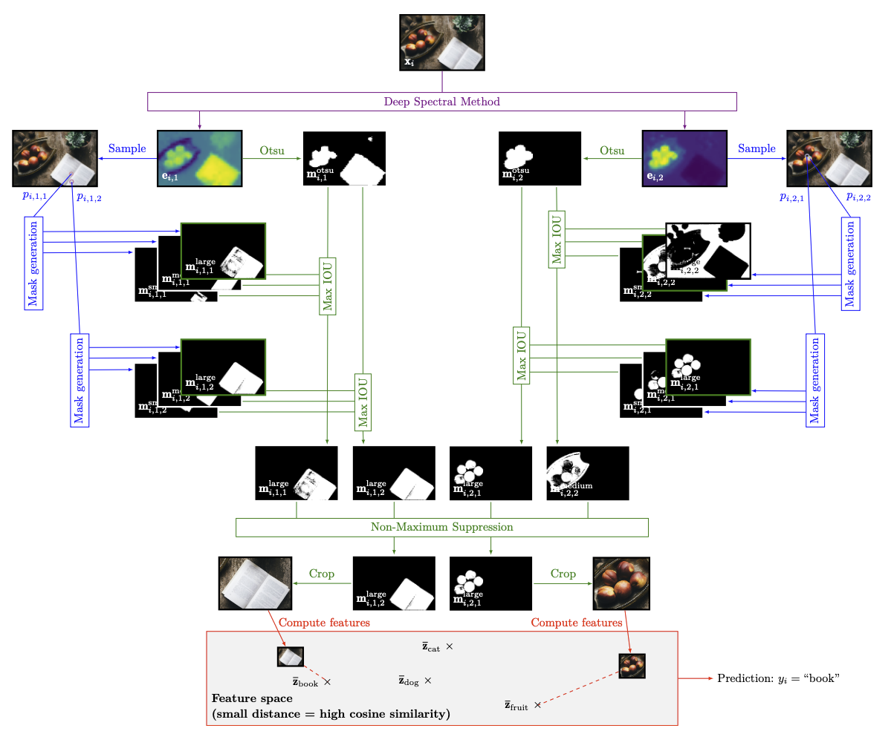
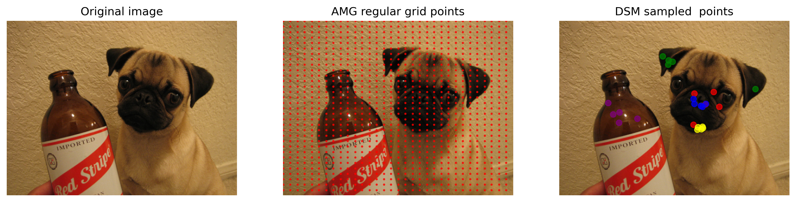
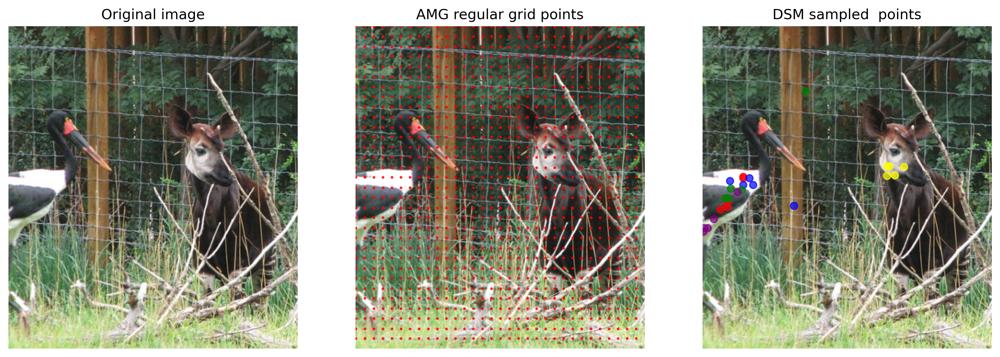

# :herb: FICUS: Few-shot Image Classification with Unsupervised object Segmentation


Official code repository for EUSIPCO 2024 paper 
"[FICUS: Few-shot Image Classification with Unsupervised object Segmentation](https://.pdf)". 

The paper is available at [https:/lien eusipco.pdf](https://.pdf).

[IMT Atlantique](https://www.imt-atlantique.fr/en) 
Jonathan Lys, Frédéric Lin, Clément Beliveau, Jules Decaestecker 
[Lab-STICC](https://www.imt-atlantique.fr/fr/recherche-innovation/communaute-scientifique/organismes-nationaux/lab-sticc)
Yassir Bendou, Aymane Abdali,Bastien Pasdeloup

[](https://github.com/ambv/black)
[](https://www.python.org/)
[](https://pypi.python.org/pypi/ansicolortags/)
<CENTER>

</CENTER>

This repository contains the code for out of the box ready to use few-shot classifier for ambiguous images. In this paper we have shown that removing the ambiguity from the the query during few shot classification improves performances. To do so we use a combination of foundation models and spectral methods. 
## Installation 🛠 

### Conda venv

```[bash]
   git clone https://github.com/NewS0ul/FICUS.git
   cd 
   python3 -m venv ~//venvFicus
   source ~/venvFicus/bin/activate
   pip install -r requirement.txt
```
### Conda env 

```[bash]
   git clone https://github.com/NewS0ul/FICUS.git
   cd 
   conda create -n Ficus python=3.9
   conda activate Ficus
   pip install -r requirement.txt
```
## Pipeline 

The overview of the pipeline is as follows :

<CENTER>

</CENTER>

**Overview of the proposed methodology. First, eigenmaps are produced using DSM. Each eigenmap (here 2) is treated separately. Using the maps, random points (here 2) are sampled, and used to prompt SAM. For each point, we therefore obtain 3 candidate masks. Out of each group of 3 candidate masks, we keep the one that maximizes IOU with an Otsu thresholding of the map. Redundant masks are then filtered out using NMS. Finally, kept masks are used to compute feature representations of associated crops. A NCM is then applied to return a label for the image.**

## Get started 🚀

### Dataset 

For all our experiments we have used three datasets  : ImageNet , Pascal Voc and Cub

### Models 

We use two foundation model : `dinov2_vit_s_14` for image embdedding and classification and [Segment Anything ](https://github.com/facebookresearch/segment-anything) for image segmentation.

### Run inference

- To run the evaluations  
```[bash]
python3 main.py -t [type of experiment]
```
- To run deep spectral method on un image
```[bash]
python3 models/deepSpectralMethods.py
```

Expected result : 
<CENTER>

</CENTER>

<CENTER>

</CENTER>


## Citation

If you find our paper or code repository helpful, please consider citing as follows:

```
bibtex
```
